# Credpal Fintech Project

## Instructions for Employers

- For setup instructions, please refer to the README file in each folder.
- To test APIs, use the `apiguide.md` file located in the backend folder.

---

## Images

### UI/UX

#### Auth Screens
| 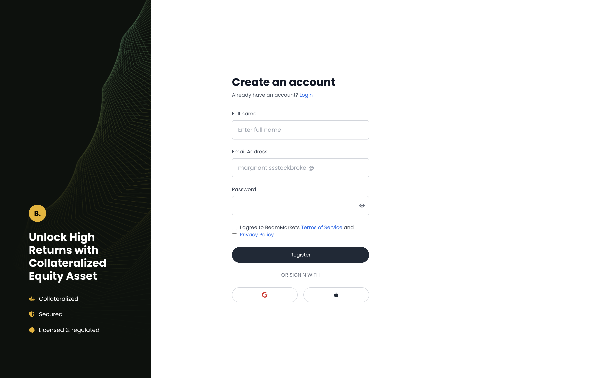 | 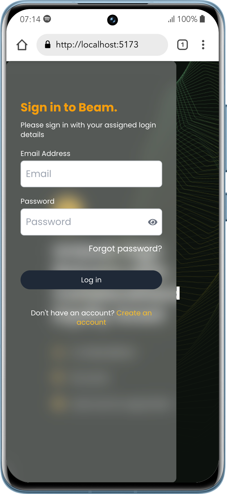 |
|-------------------------------------------|-------------------------------------------|

#### Transaction Screens
| 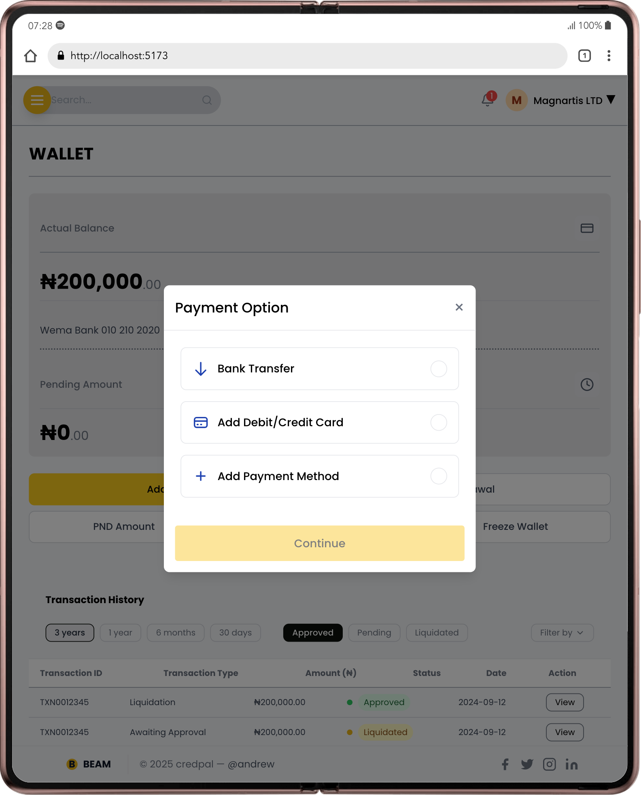 | 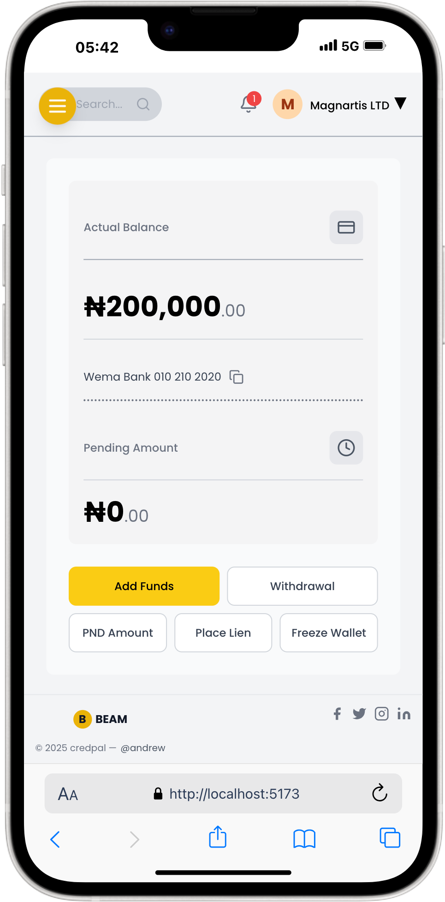 |
|---------------------------------------------------------|---------------------------------------------------------|

#### Responsiveness
| 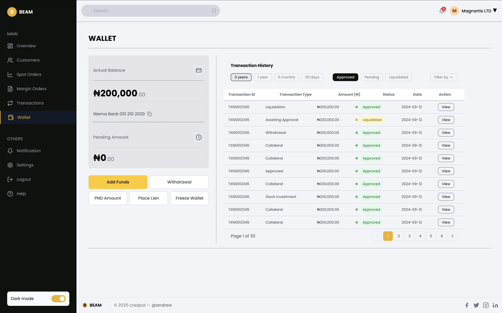 | 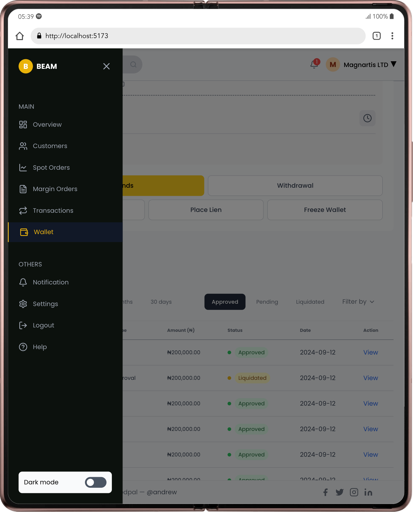 |
|---------------------------------------------------|---------------------------------------------------|

---

### Backend

#### Testing APIs with Postman
| 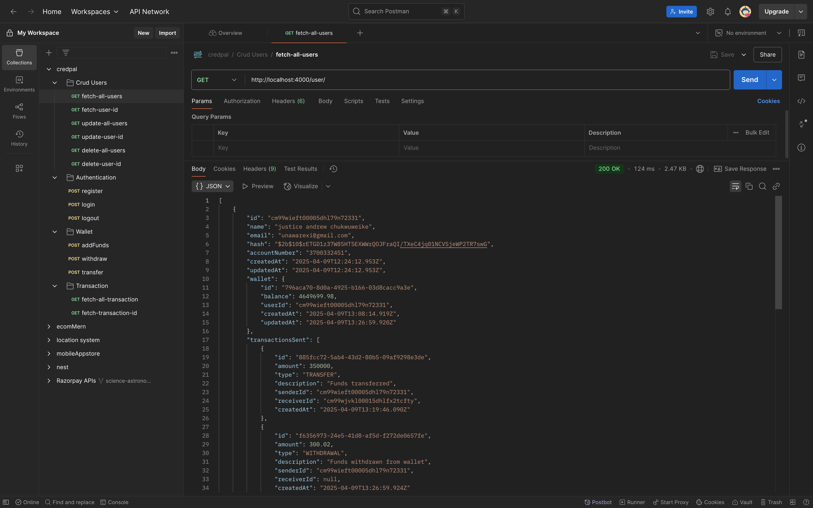 | 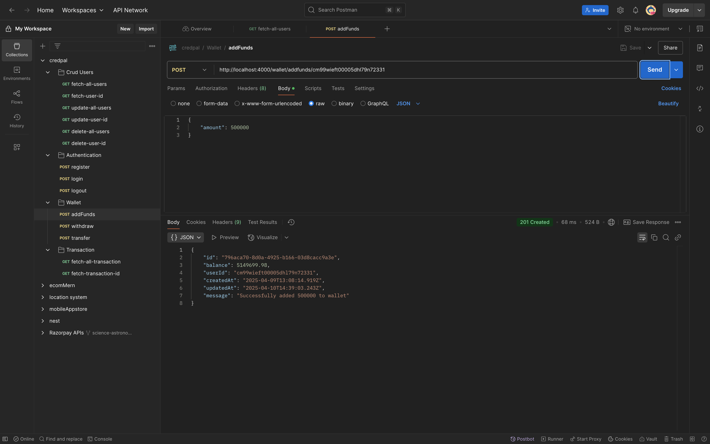 |
|---------------------------------------------|---------------------------------------------|

#### Viewing Results in Prisma Studio
| 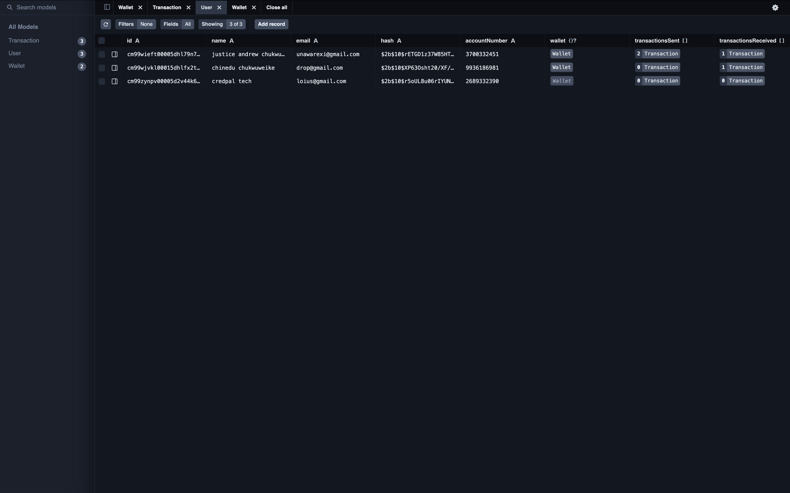 | 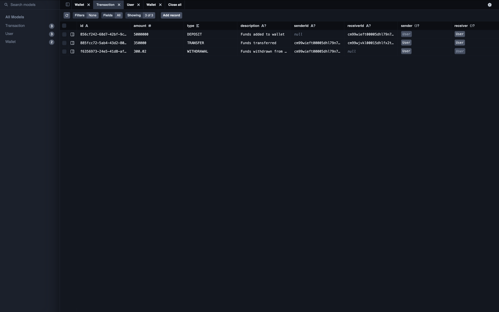 |
|-----------------------------------------------|-----------------------------------------------|

#### PostgreSQL Database
| 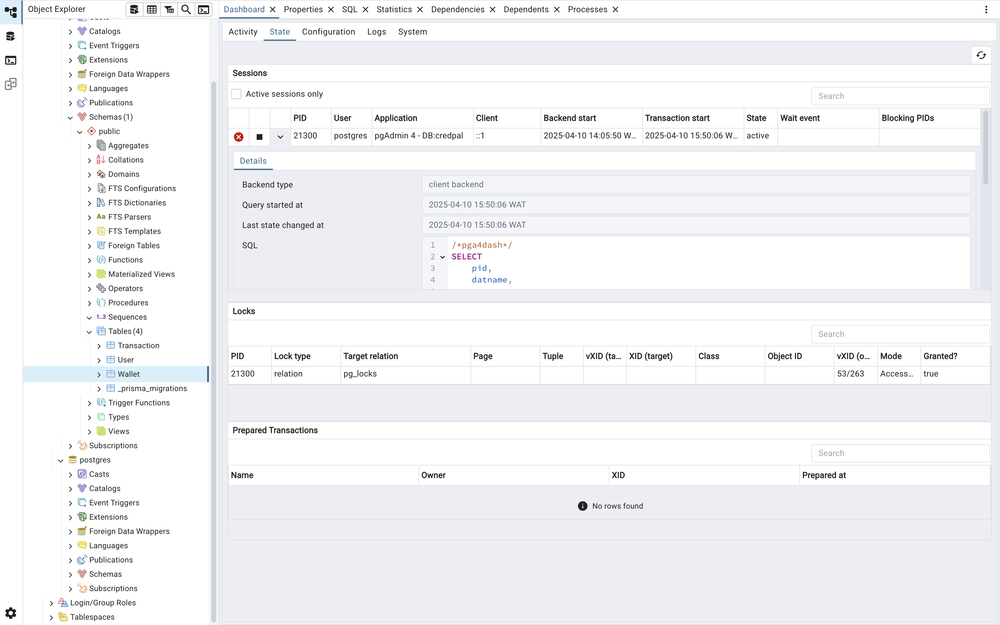 |  |
|-----------------------------------------------|-----------------------------------------------|
